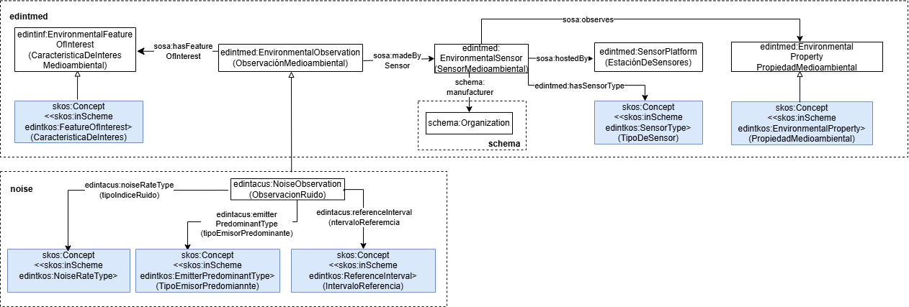

# Ontología EDINT de Sensores Medioambientales, caso Contaminación Acústica (EDINT Environmental Sensors Ontology)

Este repositorio contiene la extensión de la ontología de Sensores Medioambientales para el caso de contaminación acústica.

Ver también: [Ontología EDINT de Sensores Medioambientales](https://github.com/oeg-upm/edint-ontologia-medio-ambiente)

# Propósito y alcance de la ontología (Purpose and scope of the ontology)

 La ontología de Sensores de Medioambiente ha sufrido una pequeña ampliación para reflejar os aspectos específicos de las observaciones de ruido.

# Prefijo y espacio de nombres (Prefix and namespace)

El prefijo de la ontología de *Contaminación Acústica* es: `edintacus` publicado bajo el espacio de nombres: [http://vocab.linkeddata.es/datosabiertos/def/contaminacionacustica/](http://vocab.linkeddata.es/datosabiertos/def/contaminacionacustica/)

# Modelo conceptual (Ontology conceptualization)

# Estructura del repositorio (Repository structure)

| Carpeta | Descripción |
|--------|--------------|
| **diagrams/**     | Almacena diagramas y otros recursos que representan el modelo conceptual de la ontología (por ejemplo, jerarquías de clases, relaciones).                                     |
| **documentation/**         | Almacena la documentación HTML u orientada a humanos de la ontología y artefactos relacionados.                                                                               |
| **examples/**     | Incluye ejemplos que demuestran cómo instanciar o aplicar la ontología en escenarios de datos reales.                                                                         |
| **kos/**          | Almacena vocabularios controlados o implementación de KOS, generalmente implementaciones SKOS en RDF.                                                                         |
| **ontology/**     | Contiene los archivos de implementación reales de la ontología en formatos como `.owl`, `.rdf`, `.ttl` o `.jsonld`.                                                           |
| **requirements/** | Contiene todos los documentos utilizados para definir los requisitos de la ontología: ejemplos de datos, preguntas de competencia, requisitos funcionales, casos de uso, etc. |
| **shapes/**       | Contiene los SHACL shapes utilizadas para definir y validar las restricciones de la ontología.                                                                                |

# Mantenimiento y evolución (Maintenance and evolution)

Para manejar las incidencias o mejoras sugeridas con respecto a la ontología, recomendamos seguir las guías proporcionadas en ([Issues Management](./ISSUES.md)) para generar una incidencia.

# Financiación (Funding)

Esta ontología ha sido desarrollada en el contexto del Espacio de Datos para las Infraestructuras Urbanas Inteligentes ([EDINT](https://edint.es)).

